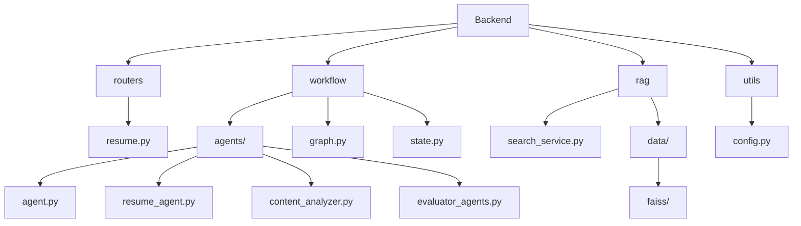
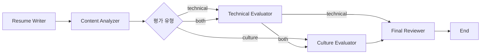

# ai-agent

ai-agent 관련 연습을 한 창구입니다 

자소서를 첨삭해주는 ai~


``` py
python -m venv venv
```

```
## 활성화

source venv/bin/activate

## 비 활성화
deactive
```

pip install -r requirements.txt


컨셉

자기소개 작성 도우미

##자소서 작성 단계 (ResumeWritingAgent)
*회사 정보, 직무 요구사항, 문항 정보를 바탕으로 초안 작성
*글자수 제한 준수

##내용 분석 단계 (ContentAnalyzer)
*작성된 자소서 초안을 분석
*기술적/문화적 측면의 평가 필요성 판단
*"technical", "cultural", "both" 중 하나로 평가 방향 결정

##기술 평가 단계 (TechnicalEvaluator)
*자소서 내용에서 검증이 필요한 기술적 키워드 추출
*RAG를 통해 관련 정보 검색 (search_info 함수 사용)
*검색된 정보를 바탕으로 진실성 검증
*기술적 역량, 프로젝트 경험 등을 평가하고 피드백 제공

##문화 평가 단계 (CultureEvaluator)
*자소서 내용에서 검증이 필요한 문화/인성 관련 키워드 추출
*RAG를 통해 관련 정보 검색
*검색된 정보를 바탕으로 진실성 검증
*조직 문화 적합성, 가치관 등을 평가하고 피드백 제공

##최종 검토 단계 (FinalReviewer)
*모든 피드백을 종합하여 최종본 작성
*글자수 제한 준수
*평가 의견을 반영한 개선

특히 중요한 점은:
*각 평가자가 RAG를 통해 객관적인 검증을 수행
*검증은 vector_store.py의 search_info 함수를 활용
*검색 데이터는 search_service.py를 통해 인터넷에서 실시간으로 수집
*평가는 단순한 내용 평가가 아닌, 실제 데이터 기반의 진실성 검증까지 포함
*이런 방식으로 더 객관적이고 신뢰성 있는 자소서 평가/피드백이 가능합니다.

# AI 자기소개서 작성 도우미

## 프로젝트 구조



## 주요 컴포넌트 설명

### 1. Routers
- `resume.py`: API 엔드포인트 정의 및 요청 처리

### 2. Workflow
- `graph.py`: 자기소개서 작성 워크플로우 정의
- `state.py`: 상태 관리 및 타입 정의
- `agents/`: 각 단계별 AI 에이전트 구현
  - `agent.py`: 기본 에이전트 클래스
  - `resume_agent.py`: 자기소개서 초안 작성
  - `content_analyzer.py`: 내용 분석 및 평가 유형 결정
  - `evaluator_agents.py`: 기술/문화 평가 에이전트

### 3. RAG (Retrieval Augmented Generation)
- `search_service.py`: FAISS 기반 유사도 검색 구현
- `data/faiss/`: 벡터 데이터베이스 저장소

### 4. Utils
- `config.py`: 환경 설정 및 상수 정의

## 워크플로우 프로세스



1. **Resume Writer**: 초기 자기소개서 작성
2. **Content Analyzer**: 내용 분석 후 평가 유형 결정
3. **Evaluators**: 결정된 유형에 따라 평가 진행
   - Technical: 기술적 역량 평가
   - Culture: 문화적 적합성 평가
   - Both: 두 가지 평가 모두 진행
4. **Final Reviewer**: 모든 피드백을 반영한 최종 자기소개서 작성

## 환경 설정

```bash
# .env 파일
OPENAI_API_KEY=your_api_key
OPENAI_MODEL_NAME=gpt-3.5-turbo
OPENAI_EMBEDDING_MODEL=text-embedding-3-small
```